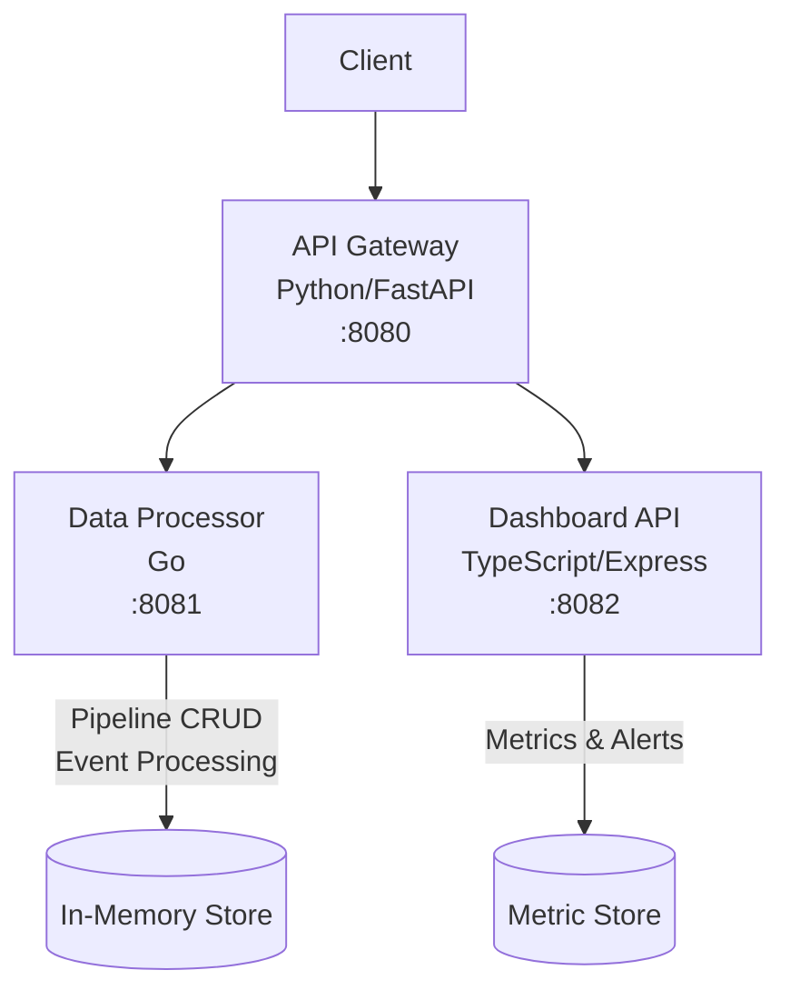

# PulseGrid

Real-time data pipeline monitoring and orchestration platform built with a microservice architecture.

PulseGrid provides a unified interface to create, monitor, and manage data pipelines. It tracks metrics, detects anomalies, and generates alerts when pipeline health degrades.

## Architecture



### Services

| Service | Language | Port | Description |
|---------|----------|------|-------------|
| **Gateway** | Python (FastAPI) | 8080 | API gateway that routes requests to backend services |
| **Processor** | Go (net/http) | 8081 | Manages pipelines and processes data events |
| **Dashboard** | TypeScript (Express) | 8082 | Collects metrics and manages alerts |

## Quick Start

### Prerequisites

- Docker & Docker Compose
- Make (optional, for shortcuts)

### Running with Docker Compose

```bash
# Clone the repository
git clone https://github.com/mohadayo/pulsegrid.git
cd pulsegrid

# Copy environment file
cp .env.example .env

# Start all services
make up
# or
docker compose up -d

# Check service status
make status
```

### Running Locally (Development)

```bash
# Gateway (Python)
cd services/gateway
pip install -r requirements.txt
uvicorn app:app --port 8080

# Processor (Go)
cd services/processor
go run .

# Dashboard (TypeScript)
cd services/dashboard
npm install
npm run dev
```

## API Reference

### Gateway (port 8080)

| Method | Endpoint | Description |
|--------|----------|-------------|
| `GET` | `/health` | Gateway health check |
| `GET` | `/health/all` | All services health check |
| `POST` | `/pipelines` | Create a pipeline |
| `GET` | `/pipelines` | List all pipelines |
| `GET` | `/pipelines/{id}` | Get pipeline details |
| `POST` | `/pipelines/{id}/events` | Send event to pipeline |
| `GET` | `/dashboard/stats` | Get dashboard statistics |

### Processor (port 8081)

| Method | Endpoint | Description |
|--------|----------|-------------|
| `GET` | `/health` | Processor health check |
| `POST` | `/pipelines` | Create a pipeline |
| `GET` | `/pipelines` | List all pipelines |
| `GET` | `/pipelines/{id}` | Get pipeline by ID |
| `POST` | `/pipelines/{id}/events` | Process a pipeline event |

### Dashboard (port 8082)

| Method | Endpoint | Description |
|--------|----------|-------------|
| `GET` | `/health` | Dashboard health check |
| `GET` | `/stats` | Get aggregated statistics |
| `POST` | `/metrics` | Record a metric |
| `GET` | `/metrics` | List metrics (filter by `pipeline_id`) |
| `GET` | `/alerts` | List alerts (filter by `resolved`) |
| `PATCH` | `/alerts/{id}/resolve` | Resolve an alert |

## Usage Examples

```bash
# Create a pipeline
curl -X POST http://localhost:8080/pipelines \
  -H "Content-Type: application/json" \
  -d '{"name": "web-logs", "source": "kafka", "destination": "s3"}'

# List pipelines
curl http://localhost:8080/pipelines

# Send an event
curl -X POST http://localhost:8080/pipelines/{id}/events \
  -H "Content-Type: application/json" \
  -d '{"pipeline_id": "{id}", "event_type": "data_ingested", "payload": {"rows": 500}}'

# Record a metric
curl -X POST http://localhost:8082/metrics \
  -H "Content-Type: application/json" \
  -d '{"pipeline_id": "{id}", "metric_name": "throughput", "value": 1500}'

# Check dashboard stats
curl http://localhost:8080/dashboard/stats

# View alerts
curl http://localhost:8082/alerts
```

## Testing

```bash
# Run all tests
make test

# Run linters
make lint

# Individual service tests
make test-gateway
make test-processor
make test-dashboard
```

## Environment Variables

| Variable | Default | Description |
|----------|---------|-------------|
| `GATEWAY_PORT` | `8080` | Gateway service port |
| `PROCESSOR_PORT` | `8081` | Processor service port |
| `DASHBOARD_PORT` | `8082` | Dashboard service port |
| `LOG_LEVEL` | `INFO` | Log level (DEBUG, INFO, WARNING, ERROR) |
| `PROCESSOR_URL` | `http://localhost:8081` | Processor URL (used by gateway) |
| `DASHBOARD_URL` | `http://localhost:8082` | Dashboard URL (used by gateway) |

## CI/CD

GitHub Actions workflow runs on push to `main` and on pull requests:

1. **test-gateway** — Python linting (flake8) and pytest
2. **test-processor** — Go vet and go test
3. **test-dashboard** — ESLint and Jest
4. **docker-build** — Docker Compose build verification

> **Note:** The `.github/workflows/ci.yml` file may need to be manually added after initial setup due to GitHub API limitations.

## Project Structure

```
pulsegrid/
├── docker-compose.yml
├── Makefile
├── .env.example
├── .gitignore
├── README.md
└── services/
    ├── gateway/          # Python FastAPI
    │   ├── app.py
    │   ├── test_app.py
    │   ├── requirements.txt
    │   └── Dockerfile
    ├── processor/        # Go
    │   ├── main.go
    │   ├── main_test.go
    │   ├── go.mod
    │   └── Dockerfile
    └── dashboard/        # TypeScript Express
        ├── src/
        │   ├── index.ts
        │   └── index.test.ts
        ├── package.json
        ├── tsconfig.json
        └── Dockerfile
```

## License

MIT
